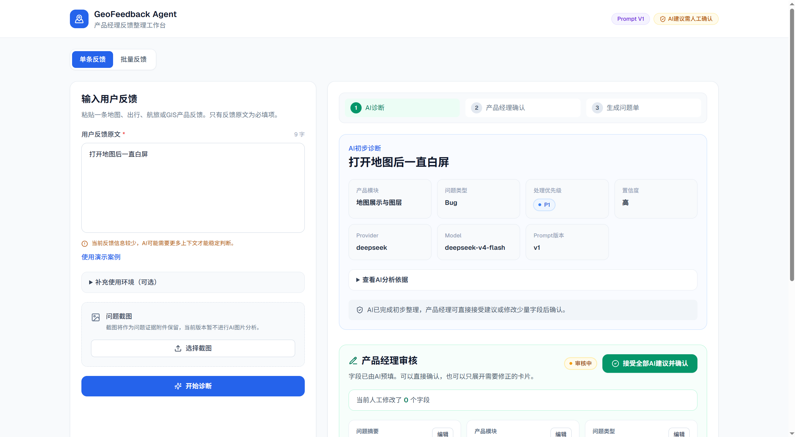
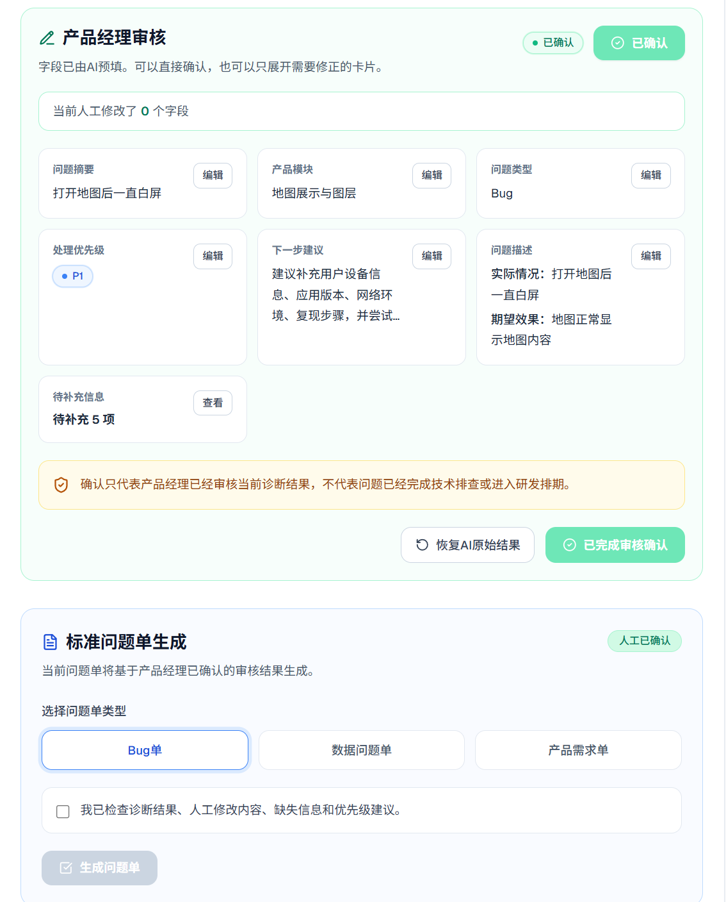
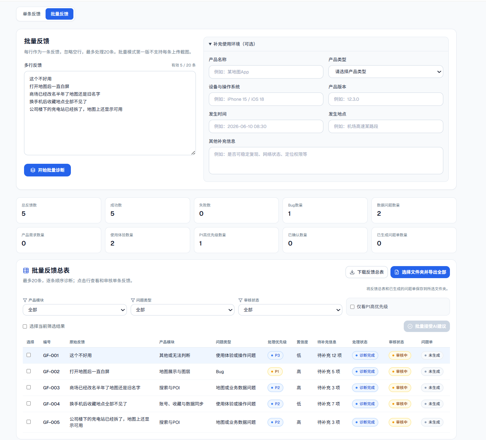

# GeoFeedback Agent

地图产品用户反馈批量诊断与问题清单工作台

GeoFeedback Agent 帮助地图、导航、航旅、智能交通和 GIS 产品经理，将一批非结构化用户反馈转化为可筛选、可审核、可导出的结构化反馈清单，并为需要进入研发流程的问题生成标准问题单。

## 在线体验

* Vercel Demo：https://geo-feedback-agent.vercel.app
* GitHub Repository：https://github.com/wangcongfelix/geo-feedback-agent

> 在线版本使用 DeepSeek API。反馈数据仅保存在当前浏览器页面内存中，截图不会上传服务器，也不会发送给模型。

## 产品截图

### 单条反馈诊断



### 产品经理人工审核



### 批量反馈整理工作台




## 项目背景

地图类产品经理经常收到来自客服、应用商店、用户访谈、群聊和业务人员的零散反馈。这些反馈通常表述不统一，Bug、数据问题、需求和操作问题混杂在一起，还经常缺少设备、版本、地点和复现信息。

如果直接把这些内容交给研发或数据团队，往往还需要产品经理二次整理：识别产品模块、判断问题类型、补齐上下文、标记不确定性、整理成标准问题单。这个过程耗时，重要问题也容易被大量低质量反馈淹没。

## 核心用户

- 地图与导航产品经理
- 航旅和智能交通产品经理
- GIS 或 B 端平台产品经理
- 用户反馈运营、客服和项目实施人员

## 当前 MVP 流程

单条模式：

```text
原始反馈与截图附件
  -> AI结构化诊断
  -> 产品经理卡片式审核
  -> 人工确认
  -> 标准问题单生成
  -> Markdown下载
```

批量模式：

```text
多行反馈输入
  -> 顺序调用模型诊断
  -> 反馈总表
  -> 筛选和批量确认
  -> 选择重点问题
  -> 导出反馈总表与问题单文件
```

## 已实现功能

- 单条反馈和批量反馈两种模式
- 批量模式最多 20 条反馈，按顺序处理，避免并发触发接口限流
- DeepSeek 真实 API 模式和 Mock 模式
- 产品模块与问题类型结构化分类
- 对明确功能异常的确定性分类兜底，降低模型过度保守地输出“信息不足”的概率
- 低置信度、待补充信息和不确定性表达
- Human-in-the-loop 人工审核流程
- 紧凑卡片式人工审核
- 一键接受 AI 建议
- 人工修改字段记录
- 截图本地预览和附件名称记录
- 批量反馈总表
- 中文状态胶囊
- CSV 下载
- 选择文件夹导出反馈总表和已生成问题单
- Bug 单、数据问题单和产品需求单 Markdown 生成
- Golden Set、Badcase 记录和 Prompt 版本实验结构

## AI 产品设计

这个项目的核心原则是：AI 只负责初步整理，不是最终决策者。

AI 会把原始反馈整理成结构化诊断，包括产品模块、问题类型、处理优先级、用户事实、AI 推测、待补充信息和不确定性。产品经理可以直接接受 AI 建议，也可以只修改少量字段后确认。

正式问题单必须在产品经理确认后才能生成，并且问题单使用的是人工确认后的结果，而不是 AI 原始结果。这样可以避免模型把未经确认的推测直接带入研发流程。

项目中也加入了少量确定性 Guardrail：当反馈明确描述“打不开、白屏、崩溃、一直加载”等功能失败时，会补充内部判断上下文，减少模型因为缺少设备、版本、复现信息而把明显异常归为“信息不足”的情况。模糊反馈则通过低置信度、待补充信息和不确定性表达。

关于“信息不足”的处理需要区分两个阶段：Prompt V1 的历史 Golden Set 中包含“信息不足，暂时无法判断”这一标准分类，用于评估模型在缺少上下文时是否能承认不确定；当前正式产品页面会尽量给出最可能的问题类型，不把“信息不足”作为最终页面分类。比如“这个不好用”这类模糊反馈，页面会展示为“使用体验或操作问题”，同时用低置信度、待补充信息和不确定性说明当前信息不足。系统不会声称 AI 一定能准确判断所有模糊反馈。

截图当前只作为证据附件保留在浏览器本地，不上传服务器，不传给 DeepSeek，也不做 OCR 或多模态分析。当前数据只保存在浏览器内存中，不使用数据库。

## 导出兼容性

反馈总表可以直接下载为 CSV。选择文件夹导出功能依赖浏览器能力：Chrome、Edge 等支持 File System Access API 的浏览器可以让用户选择文件夹，并写入反馈总表和已生成的问题单；如果浏览器不支持该 API，或用户未授予目录写入权限，系统会降级为普通下载。

网页不能绕过浏览器权限直接写入任意电脑目录，所有本地文件写入都必须经过用户主动选择和浏览器授权。

## Prompt 迭代复盘

Prompt V1 被保留为当前稳定 Demo 版本。基于 V1 的 Badcase，V2 尝试修复模块分类、推测边界、备选问题类型和处理优先级建议等问题。

回归测试发现，V2 虽然针对部分 Badcase 加了规则，但问题类型准确率出现下降。项目没有为了展示效果隐藏这个失败结果，也没有继续堆叠 Prompt 规则强行做 V3。正式 Demo 继续使用 V1，V2 实验保留在独立实验分支/版本中，后续更适合采用最小规则调整和更细的回归验证。

## 技术栈

- Next.js 14
- React
- TypeScript
- Tailwind CSS
- Zod
- OpenAI 兼容 SDK
- DeepSeek API
- Git / GitHub

## 本地运行

Windows PowerShell 环境优先使用 `.cmd` 命令，避免系统拦截 `npm.ps1` 或 `npx.ps1`。

```powershell
npm.cmd install
npm.cmd run dev
npx.cmd tsc --noEmit
npm.cmd run build
```

开发服务器启动后访问：

```text
http://localhost:3000
```

环境变量示例：

```env
AI_PROVIDER=deepseek
DEEPSEEK_API_KEY=
DEEPSEEK_MODEL=deepseek-v4-flash
USE_MOCK_AI=true
PROMPT_VERSION=v1
```

不要把真实 API Key 写入仓库。

## 项目目录

```text
app/
  Next.js 页面和服务端 API，包括主工作台和 /api/diagnose。

components/
  前端交互组件，包括批量反馈表、人工审核、状态胶囊和问题单生成。

lib/
  业务类型、Schema、问题单模板、导出逻辑、显示标签和分类兜底规则。

prompts/
  Prompt 文档版本，用于说明和追溯 Prompt 迭代。

eval/
  Golden Set、自动评测脚本输出、人工复核、Baseline 和 Badcase 记录。

scripts/
  本地评测脚本，例如 Golden Set 自动评测。

docs/
  PRD、设计文档、架构文档和求职展示材料。
```

## 项目边界

当前 MVP 不做：

- 登录
- 数据库
- 多人协作
- 自动相似反馈聚类
- RAG
- 多 Agent
- Jira 或飞书集成
- AI 截图识别
- 生产级权限和审计

这些能力不是没有价值，而是会把 MVP 从“反馈整理工作流验证”扩展成平台化系统。当前阶段优先保证核心数据流清楚、人工审核可控、评测结果可追溯。

## 开源来源

项目技术骨架参考 OpenAI Structured Outputs Sample 改造，并保留 MIT 许可证。

地图业务分类、Human-in-the-loop 流程、批量工作台、问题单生成、Golden Set 和评测体系为 GeoFeedback Agent 项目独立设计。项目不会声称所有代码从零编写，也不会把开源骨架复用包装成产品创新本身。
